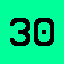

# BlockPuzzle v1.8.1

Welcome to Block Puzzle, a sliding number puzzle that will test your skill.

___
## WHAT'S NEW?

New IMPOSSIBLE Board! 30x30 is now officially available. Only attempt if you have three or four hours of free time!
___

There are 16 different board sizes:

- 3x3 
- 3x4 
- 4x4 
- 4x5 
- 5x5 
- 5x6 
- 6x6 
- 6x8 
- 8x8 
- 8x10 
- 10x10 
- 10x12 
- 12x12 
- 15x15 
- 20x20 
- 25x25 Extreme 
- 30x30 Impossible 

On each one, you will have one "hole" that you can use for moving the numbers around. See the image below if you're wondering what I mean by this.

There are also color codes for which numbers are in the correct spot. A number is green when it is "solved".

Simply hit "New Game" on a board to get started! But be aware that the boards are randomly generated and thus some boards may be unsolvable - if you come across this problem where only two numbers are not in their correct positions, you'll get a prompt that asks if you wish to start a new game.

This game is keyboard compatible too! Press <kbd>N</kbd> on your keyboard to start a new game, and use the arrow keys or the WASD keys to move the tiles! This feature was added in v1.4.0.

You can also try out Dark Mode on any board! Simply click "Switch to Dark Mode" to try it out! This feature was added in v1.7.0.

But enough talk - click [here](https://marblelover003.github.io/BlockPuzzle) to get started!
